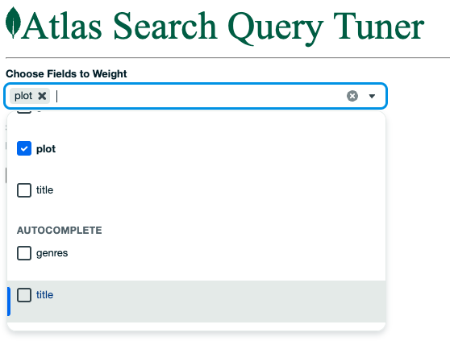
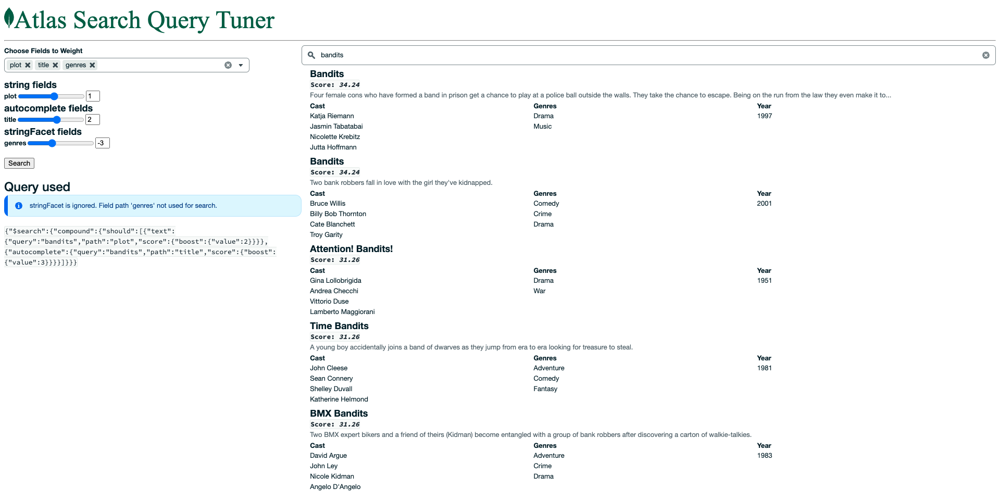

# Atlas Search Tuner (Leafy Tuna Fish)
This is a NextJS application that allows a user to select fields and give them different weights for searching.

The fields to select are automatically fetched from the Atlas Search index definition. If an unsupported field is selected a warning message is displayed. But currently the application is [coded to only fetch 'string' and 'autocomplete' field types](https://github.com/JohnGUnderwood/atlas-search-tuner/blob/5936fdb03a0d33c83f654648ae3a5644a0d2a652/tunafish/pages/index.js#L235C59-L235C59)

The application generates a boosted query and displays the results along with the generated Aggregation Pipeline $search stage.

