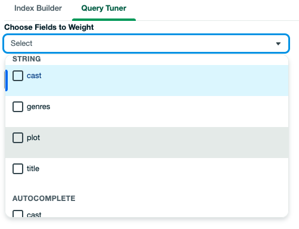

# Atlas Search Builder (Leafy Tuna Fish)
## What
This is a NextJS application that allows a user to create an Atlas Search Index and tune $search queries using a graphical interface.
## Purpose
To help application developers who are unfamiliar with search to add sophisticated text search experiences to their apps using Atlas Search.
## Audience
Novice Atlas Search users and application developers.

## How to run the app
The app uses the [NextJS framework](https://nextjs.org/) which is based on React and NodeJS. [MongoDB Leafygreen-ui](https://www.mongodb.design/) components have also been used, as well as NextJS API routes.

### Via NodeJS

You can run the app in development mode:
```
$ cd ./tunafish
$ npm run dev
```
Or build it for deployment:
```
$ cd ./tunafish
$ npm build
$ npm start
```
The app will run on `http://localhost:3000`

### Via docker

You can run a pre-created image:
```
$ docker run -t -i -d -p 5050:3000 --name tunafish --restart unless-stopped graboskyc/tunafish:latest
```

Or you can build locally in docker
```
$ ./build.sh
```
The app will run on `http://localhost:5050`

## How to use the app
You will need a valid connection string and network access to an Atlas Cluster to connect.


Once connected the app uses the [mongodb-schema package](https://www.npmjs.com/package/mongodb-schema) (as used by [Compass](https://www.mongodb.com/products/tools/compass)) to retrieve 1000 samples and generate a schema analysis.

### Index Builder
With the schema analysis the application is able to make suggestions for how to index different fields for search. The user is guided through a 'placeholder' search application which provides visual cues to help them construct the search experience for their app.


The tutorial covers three sections: facets, autocomplete (search bar), and search fields (results). When the user clicks on a section they are presented with some helpful information, links to documention, and a dropdown of suggestd fields that they can select to create a new search index defintion.

 

Once the index defintion has been built up the user can click 'save'. This creates the new index definition. The App waits for the new index to be built and when it completes will retrieve some data to show what the user has configured.

 

### Query Tuner
Once the index is created the user must re-submit a connection to use the new index definition (which is auto-populated in the connection form). Then they will navigate to the 'Query Tuner' tab.

The Query Tuner allows the user to create search queries by picking fields to search across and giving them different 'weights'. This shows the developer how to create a search query and how to apply simple boosting rules. The tuner parses the index defintion to find out which fields can be suggested for 'string' and for 'autocomplete' queries.

 

The user can now copy the generated query that is displayed in the UI and use it in their application or for further development in a tool such as Compass.
